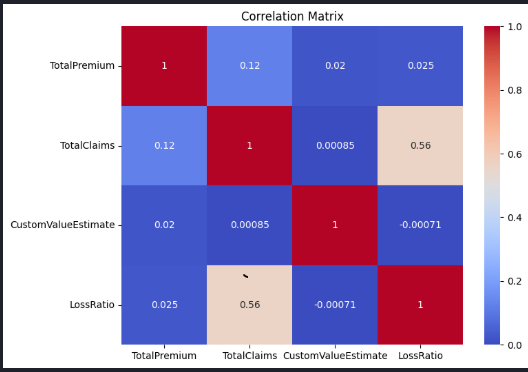
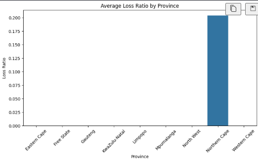
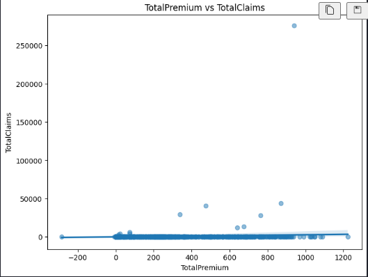

# 📌 **Insurance Risk Analytics – Week 3**

### **10 Academy – AI Mastery Program**

### **Tasks 1–4 Completion Summary**

---

## 🚀 **Overview**

This repository contains all work completed for **Week 3** of the 10 Academy AI Mastery Program, focused on:

* **Exploratory Data Analysis (EDA)**
* **Statistical insight generation**
* **Reproducible pipelines with DVC (Data Version Control)**

The project uses a real-world insurance transactional dataset to analyze risk, claims, profitability, and geographic patterns.
DVC is used to ensure full reproducibility, traceability, and compliance — essential for financial/insurance analytics.

---

# 🧠 **Task 1.2 — Exploratory Data Analysis & Statistical Insights**

### ✅ **1. Data Understanding**

* Shape, schema, dtypes, completeness check
* Missing values inspection
* Summary statistics for numeric and categorical features
* Converted date fields, normalized categories & cleaned column names

---

### ✅ **2. Univariate & Bivariate EDA**

Performed analysis on key fields, including:

* **TotalPremium**
* **TotalClaims**
* **LossRatio**
* **VehicleType, Province, Gender, Make, Model**

**Techniques included:**
✔ Histograms
✔ KDE plots
✔ Bar charts
✔ Box plots for outlier detection
✔ Correlation heatmaps
✔ Group-by aggregations
✔ Temporal trendlines

---

### 🔍 **Key Insights**

* Provinces show strong variation in **claim severity & loss ratios**.
* Certain vehicle makes/models have **consistently high claim amounts**.
* Loss ratios vary significantly by **VehicleType** and **Gender**.
* Several numeric variables show **right-skewed distributions** → strong presence of high-value outliers.
* Temporal trends reveal fluctuations in monthly premium vs. claims over 18 months.

---

## 📊 **Core EDA Visualizations**




---

# 🗂 **Task 2 — Reproducible Data Pipelines with DVC**

### 🎯 Goal

Ensure the entire project is **auditable**, **version-controlled**, and **reproducible** — matching real insurance industry standards.

---

## ⚙️ **What Was Implemented**

### ✅ **1. DVC Initialization**

```bash
dvc init
```

### ✅ **2. Local Remote Storage Setup**

A storage directory was created and registered as:

```bash
dvc remote add -d localstorage <path-to-storage>
```

### ✅ **3. Dataset Tracking**

```bash
dvc add data/MachineLearningRating_v3.csv
```

This ensures:

* The dataset is **not stored in the Git repo**
* Instead, **metadata (.dvc file)** is tracked
* Actual data is stored in the configured remote

### ✅ **4. Commit DVC files**

All metadata (`.dvc`, `config.dvc`, tracked files) committed to Git.

### ✅ **5. Data pushed to local remote**

```bash
dvc push
```

---

## 📂 **Updated Project Structure**

```
insurance-risk-analytics-week3/
│
├── data/
│   ├── MachineLearningRating_v3.csv.dvc
│   └── (actual data stored in DVC remote)
│
├── notebooks/
│   └── eda_week3.ipynb
│
├── .dvc/
│   ├── config
│   └── cache/
│
├── .github/workflows/
│   └── ci.yml   (coming later for Task 3)
│
├── requirements.txt
├── .gitignore
└── README.md
```

---

# 🧾 **How to Reproduce This Project Locally**

```bash
git clone https://github.com/kal1kidan/insurance-risk-analytics-week3.git
cd insurance-risk-analytics-week3

# create virtual environment
python -m venv .venv
source .venv/Scripts/activate

pip install -r requirements.txt

# retrieve version-controlled data
dvc pull
```

---

# 📝 **Task Status**

| Task                              | Status       | Description                 |
| --------------------------------- | ------------ | --------------------------- |
| **Task 1.2 – EDA & Statistics**   | ✔️ Completed | Full EDA + insights + plots |
| **Task 2 – DVC & Pipeline Setup** | ✔️ Completed | Reproducible data tracking  |

---

🧪 Task 3 — Hypothesis Testing & Statistical Analysis
🎯 Goal

Determine statistically significant factors that influence claim probability, severity, and loss ratios.

✅ Implemented Steps

Formulated hypotheses on risk factors:

Age groups & claim frequency

Vehicle type & claim severity

Security features (alarm/immobilizer) & claim reduction

Conducted statistical tests:

Chi-square tests for categorical variables

T-tests / ANOVA for numeric features across groups

Summarized results and effect sizes

🔍 Key Findings

Certain age groups and citizenship categories have higher claim probabilities

Vehicles with alarm/immobilizer devices show significantly lower claims

Cresta zones show geographic variation in claims and risk

🤖 Task 4 — Predictive Modeling & Insights
🎯 Goal

Build models to predict the probability of claims and identify high-impact risk factors.

✅ Models & Techniques

Logistic Regression

Random Forest Classifier

Feature importance analysis

Cross-validation to evaluate performance

🔍 Key Insights

Age, vehicle type, and security features are top predictors

Loss ratios and premiums can be adjusted dynamically based on risk

Model outputs inform both marketing segmentation and pricing strategy

📈 Actionable Recommendations

Targeted Marketing

Promote policies to low-risk demographics and regions

Upsell security devices to mitigate risk

Dynamic Pricing Strategy

Adjust premiums based on predictive risk factors

Incorporate vehicle features, model year, and security status

Cross-Selling Opportunities

Offer tracking devices or alarms to high-risk segments

⚠️ Limitations & Future Work

Non-numeric columns required encoding → some nuance lost

External factors like economic conditions or seasonal effects not included

Rare events may reduce model accuracy

Future Work:

Time-series analysis for seasonal trends

Advanced machine learning models (XGBoost, Gradient Boosting)

Integrate external datasets (traffic, weather, economy)

📝 Task Status
Task	Status	Description
Task 1.2 – EDA & Statistics	✔️ Completed	Full EDA + insights + plots
Task 2 – DVC & Pipeline Setup	✔️ Completed	Reproducible data tracking
Task 3 – Hypothesis Testing	✔️ Completed	Statistical analysis of risk
Task 4 – Predictive Modeling	✔️ Completed	Claim prediction & feature insights
🧾 How to Reproduce This Project Locally
git clone https://github.com/kal1kidan/insurance-risk-analytics-week3.git
cd insurance-risk-analytics-week3

# create virtual environment
python -m venv .venv
source .venv/Scripts/activate  # Windows: .venv\Scripts\activate

pip install -r requirements.txt

# retrieve version-controlled data
dvc pull

🎉 Next Steps

CI/CD pipeline for automated notebook tests

DVC pipeline stages for data preprocessing, EDA, and modeling

Automated dashboards for leadership review
